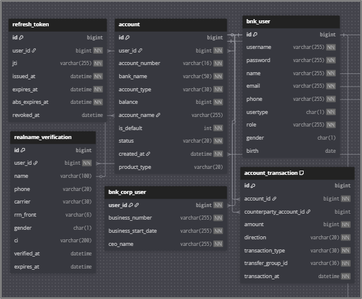
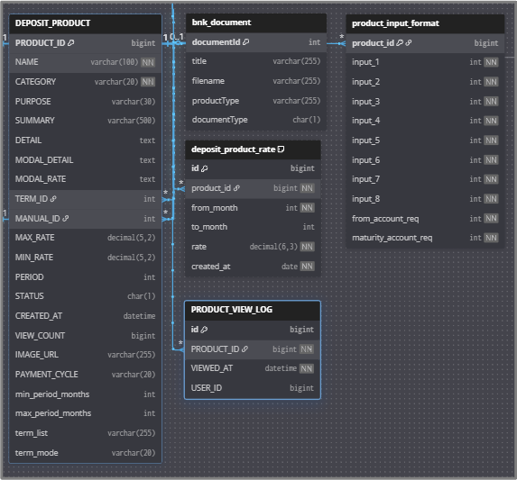
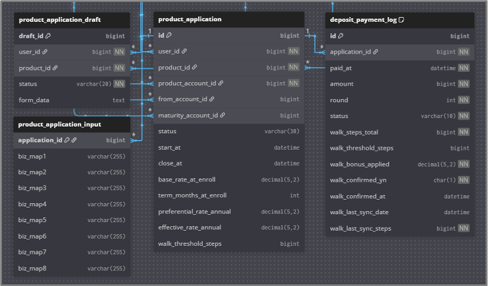
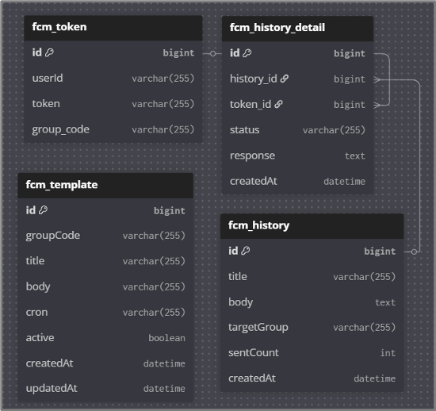

# BNK Reframe
### Open AI를 활용한 은행상품 판매를 위한 판매사이트 구축

- 본 프로젝트는 **부산은행 KDT 과정에서 진행한 2차 프로젝트**입니다.
- 유형: 팀 프로젝트(5인)
- 기간: 2025.07.25 ~ 2025.08.28

### 1차 프로젝트
- [bnk-project-1 (Spring Boot + Thymeleaf)](https://github.com/Dayeong-dev/bnk-project-1) : 웹 기반 상품 안내 및 관리 사이트

### 2차 프로젝트 - **현재 프로젝트**
- [bnk_reframe (Flutter App)](https://github.com/Dayeong-dev/bnk_reframe) : 사용자 모바일 앱
- [bnk_reframe_server (Spring Boot + Thymeleaf)](https://github.com/Dayeong-dev/bnk_reframe_server) : 서버/관리자 웹

## 📌 프로젝트 개요
본 프로젝트는 **은행 예·적금 상품 판매 플랫폼**으로,  
고객이 금융 상품을 빠르고 직관적으로 탐색하고 간편하게 가입할 수 있도록 설계되었습니다.  

### **사용자 관점**
- 키워드 검색, 필터링, 추천 상품 목록을 통한 직관적 탐색
- 상품설명서·약관 뷰어 + 요약 정보로 상품 이해도 향상
- 카드 슬라이더, 실시간 알림, 이벤트·리워드 등 참여형 요소로 흥미 유도  

### **관리자 관점**
- 상품 등록·수정·결재·승인 프로세스 체계적 관리
- 고객 정보·가입 내역·행동 데이터 기반 분석 및 전략 수립
- Excel·PDF 자동 보고서, 푸시 발송 기능으로 업무 효율성 향상  

### **AI 기능**
- OpenAI 챗봇을 통한 금융상품 자동 상담
- 리뷰 감성 분석 및 자동 응답 처리
- 사용자 경험 고도화 & 서비스 차별성 강화  

## 👥 팀원 소개
| 담당자 | 역할 | 주요 구현 내용 |
| --- | --- | --- |
| **윤다영(팀장)** | 로그인/회원가입, 상품가입 | JWT 기반 로그인, 생체인증 연동 본인인증, 상품 가입 단계 구현 |
| **차수현** | 예·적금 관리, 지도 | 예·적금 상품 검색/목록/상세 지도 API 연동(내 근처 영업점), 전체 화면 UI |
| **박정원** | 리워드/테스트/쿠폰 관리 | 오늘의 운세, 스탬프 리워드, 저축성향 테스트 관리자 통계 데이터 리포트(PDF/엑셀 다운로드) |
| **김법진** | 관리자 기능(API) | 가입 현황·이탈율·리뷰 등 데이터 분석 및 그래프(차트) 제공 상품 관리, 푸시 알림 기능 |
| **오건윤** | OpenAI, 고객센터 | AI 챗봇, FAQ 자동응답 리뷰 작성·조회·분석, 웹 소켓 통신(Netty) |

## 🛠️ 기술 스택
- **Back-end**: Spring Boot(Java), Spring Security, **JWT**, **Netty WebSocket Gateway(실시간)**
- **Front-end**: Thymeleaf, HTML/CSS, JavaScript, **Flutter**
- **Database**: Oracle DB, Spring Data JPA
- **Cloud/Service** : **Firebase**
- **Communication & Tools**: Notion, GitHub, GitHub Desktop

## ✨ 주요 기능
### 사용자
- **본인인증 & 상품 가입 프로세스**  
  본인인증 시뮬레이션 → 약관(PDF) 열람 필수 → 입력 조건 검증 → 가입 완료
   
- **예·적금 상품 탐색**  
  예·적금 상품 검색/추천/자동완성 기능 및 이자 계산기 제공
   
- **생체인증 로그인**  
  지문·Face ID를 통한 자동 로그인 및 2차 인증
   
- **오늘의 운세 & 맞춤형 추천**  
  AI 기반 운세 제공 + 관련 상품 추천
   
- **이벤트·리워드 시스템**  
  친구 초대 → 스탬프 적립 → 쿠폰 발급
   
- **지도 기반 서비스**  
  사용자의 현재 위치 주변 영업점·ATM 검색 및 즐겨찾기
   
- **AI 챗봇 (텍스트 + 음성)**  
  OpenAI 기반 챗봇, 음성 입력/출력 지원으로 대화형 상담 제공

### 관리자
- **Excel·PDF 자동 보고서**  
  가입 현황, 이탈율, 리뷰 통계 등 리포트 다운로드  
- **앱 푸시 발송 기능**  
  템플릿 작성/수정, 즉시/예약 발송, 발송 이력 관리  

### 실시간 기능 (Netty WebSocket)
- 리뷰 등록 → 사용자 & 관리자 화면에 즉시 반영
- 상품 상세 페이지 → 동시 접속자 수 실시간 표시
- 이벤트/쿠폰 발송 → 사용자 앱에 즉시 알림 도착

## 📚 DB 설계
### 사용자, 인증, 계정 테이블
> [사용자, 인증, 계정 테이블](docs/BNK_2차_프로젝트_ERD_사용자_인증_계정.png)

### 예·적금 상품, 상품 설명서, 금리 테이블
> [예·적금 상품, 상품 설명서, 금리 테이블](docs/BNK_2차_프로젝트_ERD_상품_설명서_금리.png)

### 상품 가입, 신청, 납입 테이블
> [상품 가입, 신청, 납입 테이블](docs/BNK_2차_프로젝트_ERD_가입_신청_납입.png)

### 앱푸시 알림 마케팅 분석 추천 테이블
> [앱푸시 알림 마케팅 분석 추천 테이블](docs/BNK_2차_프로젝트_ERD_앱푸시.png)

## 📈 플로우차트
### 로그인 & 인증 플로우
Splash 화면 이후 **토큰 유효성 검사**(Access/Refresh)와 **생체인증 여부 확인**을 통해  
사용자가 안전하게 홈 화면으로 진입하는 과정을 나타냅니다.

> [로그인 & 인증 플로우 보기](docs/BNK_2차_프로젝트_플로우차트_로그인.png)

### 상품 가입 플로우
사용자가 상품을 선택한 뒤 **본인인증 → 약관 열람 → 조건 입력 → 최종 확인 → 생체인증**을 거쳐  
가입을 완료하는 실제 금융 앱과 유사한 절차를 정의했습니다.

> [상품 가입 플로우 보기](docs/BNK_2차_프로젝트_플로우차트_상품가입.png)

### 예·적금 탐색 플로우
사용자가 홈 화면에서 예·적금 상품을 탐색할 때  
**검색/필터링/추천** 과정을 거쳐 상세 화면으로 이동하는 흐름을 정리했습니다.

> [예·적금 탐색 플로우 보기](docs/BNK_2차_프로젝트_플로우차트_예적금.png)

## 📊 기대 효과
- **고객 만족도 향상** : 직관적인 상품 검색·추천과 AI 챗봇 응답으로 빠르고 정확한 문의 해결
- **상담·운영 효율화** : 상품 관리, 푸시 발송, 리포트 자동화로 직원 업무 부담 감소
- **데이터 기반 개선** : 고객 행동 데이터·리뷰 분석을 통한 상품 기획 및 마케팅 전략 고도화
- **실시간 서비스 제공** : Netty 기반 알림과 Firebase 푸시로 즉각적인 고객 대응 가능
- **디지털 소외계층 편의성 제공** : 간편한 UI/UX와 모바일 지원으로 누구나 쉽게 접근 가능

## 📄 기타 문서
- [요구사항 명세서](docs/BNK_2차_프로젝트_요구사항명세서.xlsx)
- [정보구조도(사용자)](BNK_2차_프로젝트_정보구조도.png)
- [정보구조도(관리자)](BNK_2차_프로젝트_정보구조도_관리자.png)
- [와이어프레임](docs/BNK_2차_프로젝트_와이어프레임.pdf)
- [테이블명세서](docs/BNK_2차_프로젝트_테이블명세서.xlsx)
